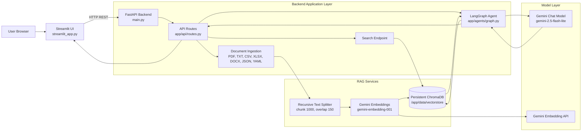
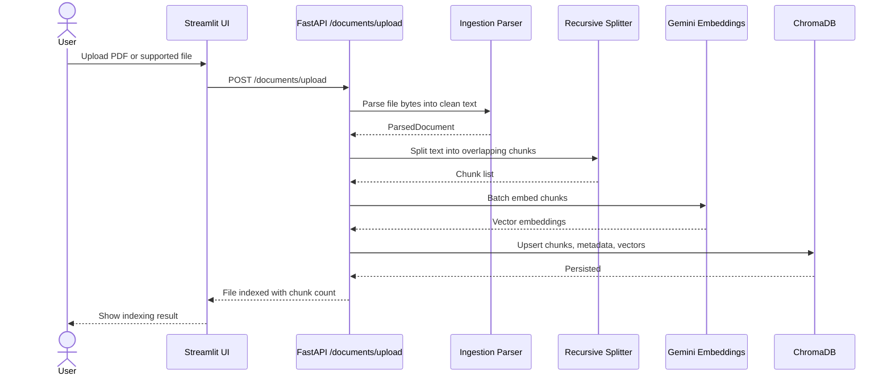
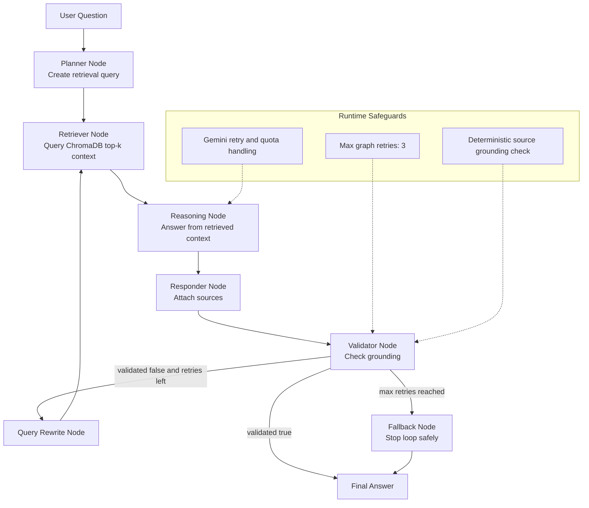
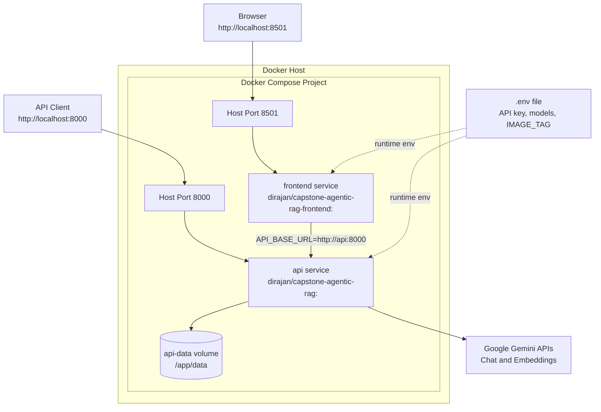
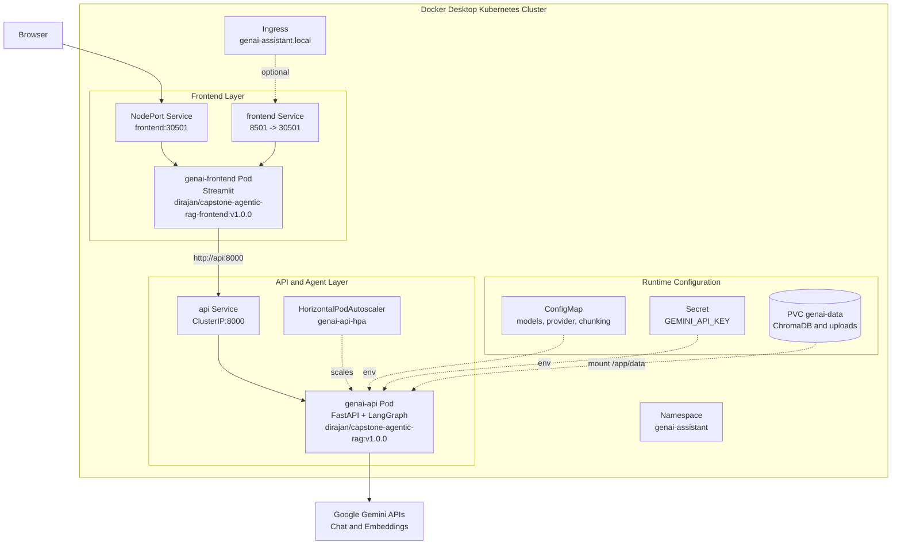
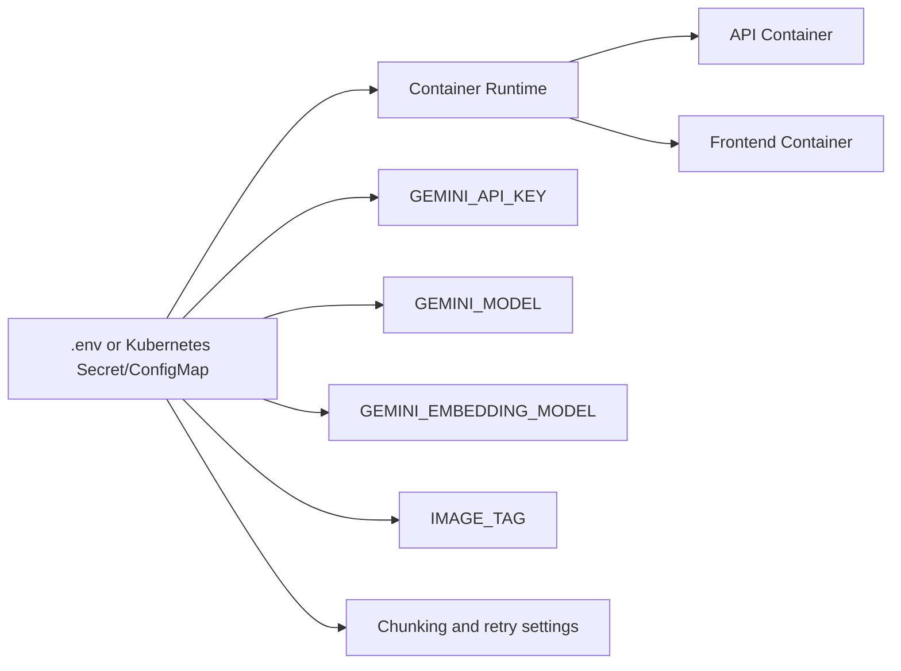

# Architecture Diagrams

This document shows how the GenAI Document Assistant works and how it is deployed with Docker Compose and Kubernetes.

## 1. Application Working Architecture



## 2. Document Upload And Indexing Flow



## 3. LangGraph Agentic RAG Flow



## 4. Docker Compose Deployment Diagram



Runtime image selection:

```env
API_IMAGE_REPOSITORY=dirajan/capstone-agentic-rag
FRONTEND_IMAGE_REPOSITORY=dirajan/capstone-agentic-rag-frontend
IMAGE_TAG=v1.0.0
```

## 5. Kubernetes Deployment Diagram



Kubernetes access points:

```text
UI:       http://localhost:30501
API:      internal service http://api:8000
Namespace: genai-assistant
```

## 6. Runtime Configuration Summary



Key point: images are built once and reused across systems. API keys, model names, embedding model names, and image tags are injected at runtime.
